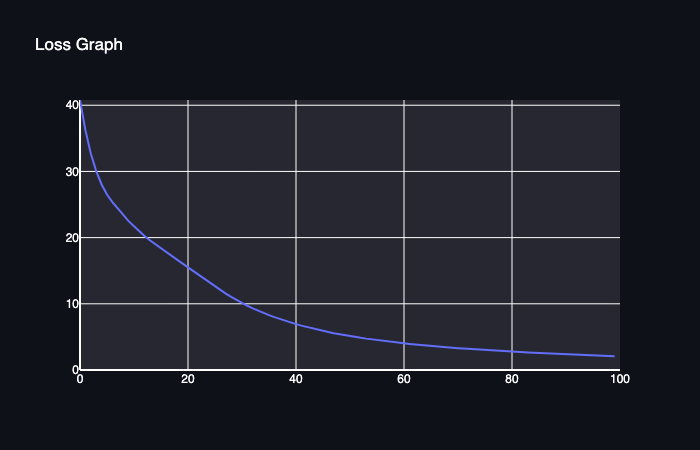
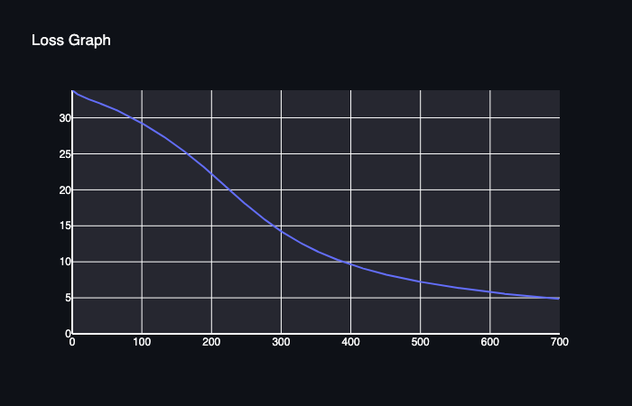

[](https://classroom.github.com/a/YFgwt0yY)
# MiniTorch Module 2


* Docs: https://minitorch.github.io/

* Overview: https://minitorch.github.io/module2/module2/

This assignment requires the following files from the previous assignments. You can get these by running

```bash
python sync_previous_module.py previous-module-dir current-module-dir
```

The files that will be synced are:

        minitorch/operators.py minitorch/module.py minitorch/autodiff.py minitorch/scalar.py minitorch/scalar_functions.py minitorch/module.py project/run_manual.py project/run_scalar.py project/datasets.py


## Setup

MiniTorch requires Python 3.11 or higher. To check your version of Python, run either:
```
python3 --version
```
or
```
python --version
```

To create a virtual environment, run:
```
python3.11 -m venv .venv
```

To activate the virtual environment use:
```
source .venv/bin/activate
```
To deactivate the virtual environment use:
```
deactivate
```

To install packages use:
```
python3 -m pip install -r requirements.txt
python3 -m pip install -r requirements.extra.txt
python3 -m pip install -Ue .

```

Change numpy version to 1.24.4

## Testing

Command to run before commit for style check:
```
pre-commit run --all
```

Run tests:
```
pytest
```
Run marked task:
```
pytest -m task1_1
```

To run the app:
```
streamlit run project/app.py -- 2
```

## Task 2.5: Training

### 1. Simple Dataset

Simple Dataset, 50 data points

Time per epoch: 0.045s

Parameters
- Hidden Layers: 3
- Learning Rate: 0.5
- Epochs: 100

Results
- Loss per epoch


- Loss graph


- Classification result


### 2. Diagonal Dataset

Diagonal Dataset, 50 data points

Time per epoch: 0.044s

Parameters
- Hidden Layers: 3
- Learning Rate: 0.5
- Epochs: 100

Results
- Loss per epoch


- Loss graph



- Classification result


### 3. Split Dataset

Split Dataset, 50 data points

Time per epoch: 0.216s

Parameters
- Hidden Layers: 10
- Learning Rate: 0.1
- Epochs: 700

Results
- Loss per epoch


- Loss graph



- Classification result


### 4. Xor Dataset

Xor Dataset, 50 data points

Time per epoch: 0.462s

Parameters
- Hidden Layers: 16
- Learning Rate: 0.1
- Epochs: 800

Results
- Loss per epoch


- Loss graph


- Classification result


